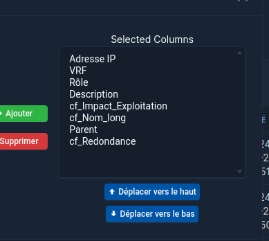

## Gestion des Impacts
### 1. Introduction

# To do

- [ ] table gestion IPAM IP LEFT JOIN IMPACT 
- [ ] 
- [ ] bulk import list equipment IP => impact
- [ ] name soit device => vm => cf nom_long
- [x] PK (IP-VRF)
- [ ] bulk bool redundacy et impact ( plain text ) 
- [ ] aide a bulk import/edit
- [ ] tab filter (VRF / IP / Device / Impact / Redundancy / VM / cf_nomlong)
- [ ] change selection delete button
- [ ] add button in detail view IP to Impact
- [ ] investigate on help button => do docs
- 